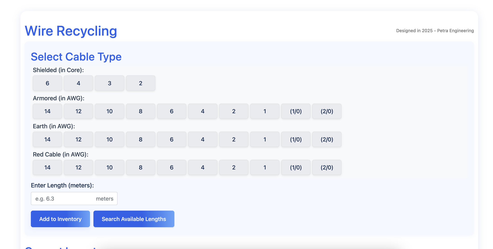
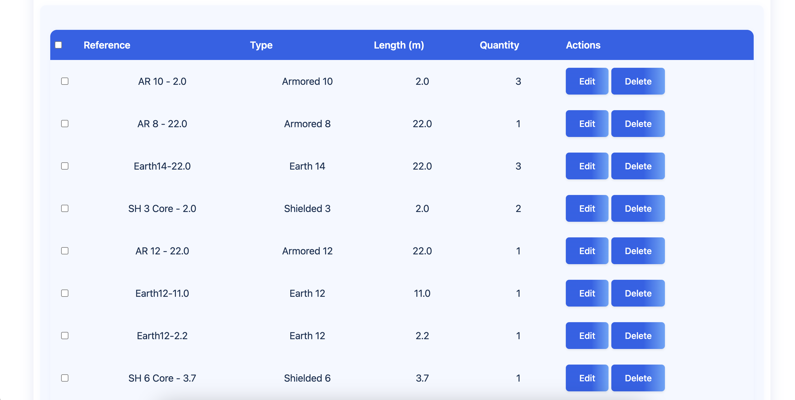
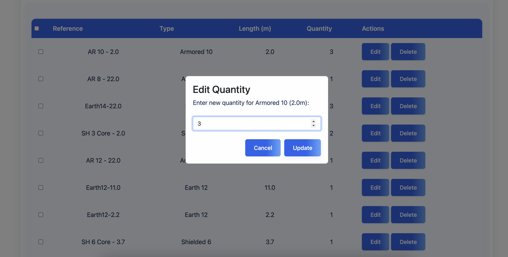

I have created this project focusing on developing a system to recycle leftover HVAC wiring, reducing material waste and improving inventory management. The process involved collecting unused cable segments, categorizing them by length, and designing methods to repurpose them for future installations rather than discarding them. By tracking wire usage and recycling cut-offs, the project not only minimized costs but also promoted sustainability in electrical design workflows.

